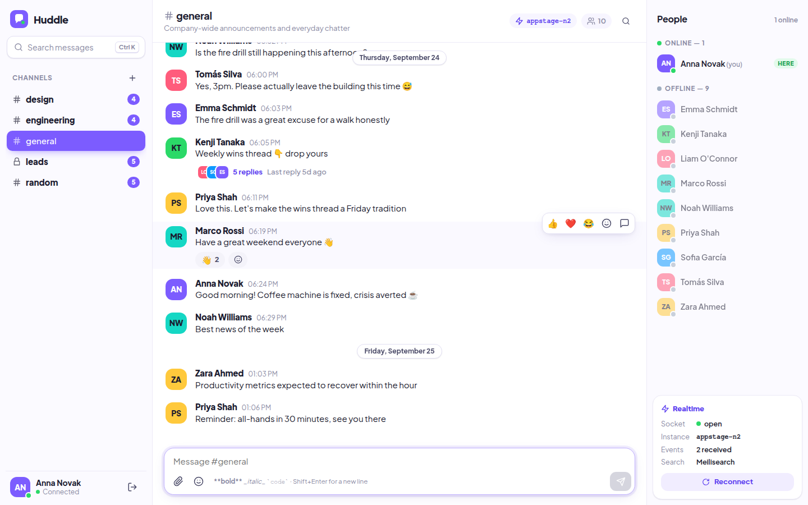

# Huddle — real-time community chat

A self-hosted mini Slack / Discord: channels, live messages, typing indicators, presence, threads, reactions, file attachments and instant typo-tolerant search. Built and deployed on [Zerops](https://zerops.io) with ZCP (Zerops Control Plane).

**Live demo:** https://appstage-3246-3000.prg1.zerops.app — open it in two tabs and sign in as two different people.



## Features

- Channels (public + private) with unread and @mention badges
- Instant delivery over WebSockets, typing indicators, online / away / offline presence
- Threaded replies, edit / delete, emoji reactions, markdown
- Drag-and-drop attachments with background-generated thumbnails
- ⌘K / Ctrl+K search with highlighted snippets and jump-to-message
- Infinite scroll with cursor pagination, smooth over thousands of messages
- Optimistic sending, and gap-free catch-up after a reconnect

## Architecture

| Piece | What it does |
|---|---|
| **App** (this repo) — Node 24, Fastify, `ws`, Vue 3 + Vite + TypeScript | API, WebSocket server and the web client |
| **Worker** — [huddle-chat-worker](https://github.com/EleftheriaBatsou/huddle-chat-worker) | Image thumbnails and bulk search reindexing |
| **PostgreSQL** | Durable history: users, channels, messages, attachments, reactions |
| **Valkey** (Redis-compatible) | Pub/sub fan-out between app instances, presence, typing, unread counts, rate limiting |
| **NATS JetStream** | Job queue between the app and the worker |
| **Meilisearch** | Message search (falls back to Postgres full-text search if absent) |
| **Object storage** (S3-compatible) | Attachments, uploaded directly from the browser via presigned URLs |

**Scaling out:** every app instance publishes events to one Valkey channel and delivers only what it receives from there. So the app runs as several instances behind a load balancer, and a user connected to instance A still gets messages from a user on instance B. The header chip in the UI shows which instance your socket is on.

## Project layout

```
server/   Fastify API, WebSocket hub, Valkey/NATS/Meilisearch/S3 adapters, seed data
web/      Vue 3 client (components, Pinia store, reconnecting socket)
shared/   Types shared by server and client (REST + WebSocket contract)
zerops.yaml  Build & run config for Zerops (dev and prod setups)
```

## Running it

It's designed for Zerops, where `zerops.yaml` wires every connection string from the managed services. Configuration is entirely env-based:

`DATABASE_URL`, `REDIS_URL`, `NATS_HOST`, `NATS_PORT`, `NATS_USER`, `NATS_PASS`, `MEILI_HOST`, `MEILI_MASTER_KEY`, `S3_ENDPOINT`, `S3_BUCKET`, `S3_REGION`, `S3_KEY`, `S3_SECRET`, `APP_SECRET`

```bash
npm install
npm run dev     # Fastify + Vite (hot reload) on :3000
npm run build   # production bundle → dist/
npm start       # serve the production build
```

On first start the app creates its schema and seeds demo channels, people and a few hundred messages.

## Links

- Zerops: https://zerops.io
- Zerops docs: https://docs.zerops.io
